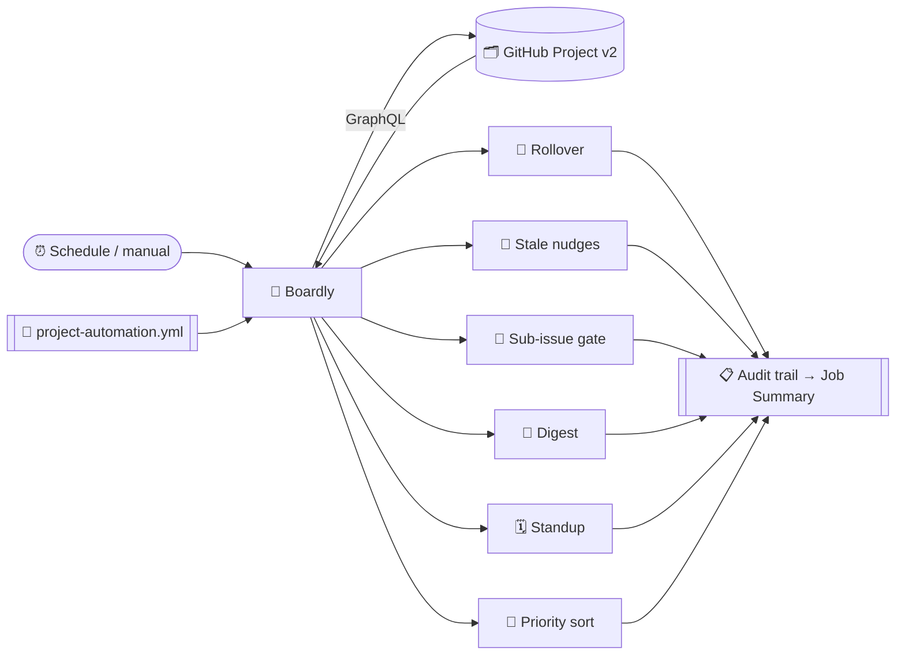
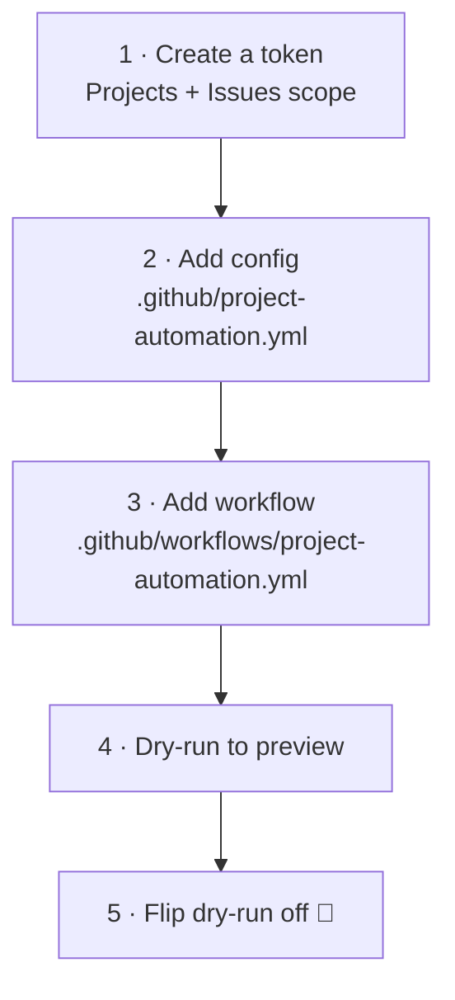

<div align="center">

# 🤖 Boardly

### Put your GitHub Projects board on autopilot.

A config-driven GitHub Action that automates **GitHub Projects (v2)** — sprint rollover, stale-card nudges, sub-issue gating, digests, standups, priority sorting, and Slack/email notifications — all from one YAML file.

<br/>

[](https://boardly.app.rsynk.com)
[](https://github.com/cdrrazan/Boardly/actions/workflows/ci.yml)
[](https://github.com/cdrrazan/Boardly/releases/latest)
[](./LICENSE)
[](https://www.typescriptlang.org/)
[](https://nodejs.org/)
[](https://docs.github.com/issues/planning-and-tracking-with-projects)
[](./test)
[](./CONTRIBUTING.md)
[](./OPEN_SOURCE.md)

**[🌐 boardly.app.rsynk.com](https://boardly.app.rsynk.com)**

[Quick start](#-quick-start) · [Features](#-features) · [Use cases](#-use-cases) · [Config](#%EF%B8%8F-configuration) · [Roadmap](./ROADMAP.md) · [Contributing](./CONTRIBUTING.md) · [Sponsor](#-support-the-project)

</div>

---

## ✨ What it does

You point the action at a Project (v2), describe your rules in `.github/project-automation.yml`, and schedule it. On every run it reads the board, applies your enabled features, and writes an **audit trail** to the Actions job summary so you can see exactly what happened.



## 🚀 Features

| | Feature | What it does |
|:--:|---------|--------------|
| 🔁 | **Sprint rollover** | When an iteration ends, move unfinished items into the next iteration so nothing is stranded in a closed sprint. |
| 🔔 | **Stale-card nudges** | @-mention owners when a card sits in a status past a threshold. De-duped so it never spams. |
| 🧩 | **Sub-issue gating + roll-up** | Block a card from staying **Done** while it has open sub-issues; optionally write completion % into a progress field. |
| 🏁 | **Sprint digest** | At iteration end, post completed-vs-carried-over counts and velocity. |
| 🗓️ | **Daily standup** | Post what moved in the last _N_ hours, grouped by assignee. |
| 🔼 | **Priority auto-sort** | Reorder the board so higher-priority cards float to the top. |
| 📣 | **Slack & email notifications** | Also deliver digests, standups, and stale alerts to a Slack channel and/or over email — not just GitHub comments. |
| 📋 | **Audit trail** | Every action (or, in `dry-run`, every _intended_ action) is written to the job summary. |

## 📚 Use cases

Every feature comes with a standalone, copy-pasteable recipe — **who it's for**, the **config**, and **what happens**. Browse them all in [`docs/use-cases`](./docs/use-cases), or jump straight in:

| # | Use case | Feature(s) |
|:--:|----------|-----------|
| 01 | [Carry unfinished work into the next sprint](./docs/use-cases/01-sprint-rollover.md) | 🔁 Rollover |
| 02 | [Nudge owners about stale cards](./docs/use-cases/02-stale-card-nudges.md) | 🔔 Stale nudges |
| 03 | [Stop premature "Done" on parent issues](./docs/use-cases/03-sub-issue-gating.md) | 🧩 Sub-issue gate |
| 04 | [Show live epic progress on the board](./docs/use-cases/04-progress-rollup.md) | 🧩 Sub-issue roll-up |
| 05 | [Auto-post a sprint retro digest](./docs/use-cases/05-sprint-digest.md) | 🏁 Digest |
| 06 | [Async daily standup for a distributed team](./docs/use-cases/06-daily-standup.md) | 🗓️ Standup |
| 07 | [Keep the backlog sorted by priority](./docs/use-cases/07-priority-sort.md) | 🔼 Priority sort |
| 08 | [Preview everything safely with dry-run](./docs/use-cases/08-dry-run-preview.md) | 📋 All + audit |
| 09 | [Automate a project spanning many repos](./docs/use-cases/09-multi-repo-project.md) | ⚙️ All |
| 10 | [Different schedules per feature](./docs/use-cases/10-per-feature-schedules.md) | ⚙️ All |
| 11 | [Solo maintainer / personal project board](./docs/use-cases/11-personal-project.md) | ⚙️ All |
| 12 | [Escalate cards ignored after a nudge](./docs/use-cases/12-escalation-with-revert.md) | 🔔 Stale + 🧩 gate |
| 13 | [Send digests & alerts to Slack and email](./docs/use-cases/13-notifications.md) | 📣 Notifications |

> New here? Start with [01 · Sprint rollover](./docs/use-cases/01-sprint-rollover.md) and [08 · Dry-run preview](./docs/use-cases/08-dry-run-preview.md).

## ⚡ Quick start



1. **Create a token.** The default `GITHUB_TOKEN` generally can't read org Projects. Create a fine-grained PAT or GitHub App token with **Projects: read & write** and **Issues: read & write**, and save it as a secret (e.g. `PROJECT_AUTOMATION_TOKEN`).

2. **Add config** at `.github/project-automation.yml` — start from [`project-automation.example.yml`](./project-automation.example.yml).

3. **Add a workflow** — see [`.github/workflows/example.yml`](./.github/workflows/example.yml):

   ```yaml
   - uses: cdrrazan/Boardly@v1
     with:
       token: ${{ secrets.PROJECT_AUTOMATION_TOKEN }}
       config-path: .github/project-automation.yml
       dry-run: "true"   # preview first; remove once it looks right
   ```

> **Versioning:** pin to **`@v1`** to always get the latest `v1.x` (bug-fixes and features, no breaking changes), or **`@v1.0.0`** to freeze an exact version.

## 🧾 Inputs & outputs

| Input | Default | Description |
|-------|---------|-------------|
| `token` | — _(required)_ | Token with `project` + `issues` access to the target project. |
| `config-path` | `.github/project-automation.yml` | Path to the config file. |
| `only` | `""` | Run just one feature: `rollover`, `stale-nudge`, `sub-issue-gate`, `digest`, `standup`, `priority-sort`. Empty runs every enabled feature. |
| `dry-run` | `false` | Log every intended action to the audit trail without making changes. |

**Output:** `actions-count` — number of mutating actions taken (or that would be taken in dry-run).

## ⚙️ Configuration

Everything is declared in one YAML file. Minimal example:

```yaml
project:
  owner: my-org
  type: org        # or "user"
  number: 5
fields:
  status: Status
  iteration: Sprint
  priority: Priority
doneStatuses: ["Done"]
features:
  rollover:
    enabled: true
  staleNudge:
    enabled: true
    rules:
      - status: "In Progress"
        days: 3
        notify: assignees
```

Full reference: [`project-automation.example.yml`](./project-automation.example.yml).

## 📣 Notifications (Slack & email)

By default, digests, standups, and stale alerts are posted to GitHub. You can **also** deliver them to a Slack channel and/or over email by adding a `notifications` block. Secrets are referenced by **environment-variable name** — never inline the webhook URL or SMTP password in config; pass them from encrypted secrets via the workflow's `env:`.

```yaml
# in project-automation.yml
notifications:
  slack:
    enabled: true
    webhookEnv: SLACK_WEBHOOK_URL      # env var with a Slack Incoming Webhook URL
  email:
    enabled: true
    host: smtp.example.com
    port: 587
    secure: false                      # true for port 465
    userEnv: SMTP_USER
    passwordEnv: SMTP_PASS
    from: "Boardly <bot@example.com>"
    to: ["team@example.com"]
```

```yaml
# in your workflow — map the secrets into the environment
- uses: cdrrazan/Boardly@v1
  with:
    token: ${{ secrets.PROJECT_AUTOMATION_TOKEN }}
  env:
    SLACK_WEBHOOK_URL: ${{ secrets.SLACK_WEBHOOK_URL }}
    SMTP_USER: ${{ secrets.SMTP_USER }}
    SMTP_PASS: ${{ secrets.SMTP_PASS }}
```

Both channels are optional and independent — enable either, both, or neither. A channel failure is logged as a warning and never aborts the run, and nothing is sent under `dry-run`. See the [notifications recipe](./docs/use-cases/13-notifications.md).

## 🧠 How it decides things

- **"Time in status"** is approximated by when the Status field value was last changed (Projects v2 exposes each field value's `updatedAt`). It is not a full status-history walk.
- **Iterations** come from the iteration field's configuration. Rollover and digest act on the most recently *completed* iteration; new work rolls into the first *active* iteration.
- **Sub-issues** use the native GitHub sub-issues API (`subIssuesSummary`), requested with the `sub_issues` GraphQL feature header.
- **Priority sort** uses `updateProjectV2ItemPosition`. Manual order only shows on a board view whose sort is set to **manual** — a field-sorted view overrides it.

## 🛠️ Development

```bash
npm install
npm run typecheck   # tsc --noEmit
npm test            # unit tests (node:test + tsx)
npm run build       # bundle src -> dist/index.js (committed; required for JS actions)
npm run all         # typecheck + test + build
```

The bundled `dist/index.js` is committed so the action runs without a build step. Rebuild and commit it whenever you change `src/`.

**Built with:** TypeScript · Node 20 · Octokit GraphQL · Zod · ncc — see the full [**Tech Stack**](./TECH_STACK.md) and [**Architecture**](./docs/ARCHITECTURE.md).

## 🗺️ Roadmap

Working-days awareness, escalation ladders, iteration auto-assignment, capacity warnings, and more — see [**ROADMAP.md**](./ROADMAP.md).

## 🤝 Contributing

Contributions are very welcome! Read the [**Contributing Guide**](./CONTRIBUTING.md) and our [**Code of Conduct**](./CODE_OF_CONDUCT.md) to get started. Found a security issue? See [**SECURITY.md**](./SECURITY.md).

## ❤️ Support the project

Boardly is free and open source. If it saves your team time, please consider sponsoring — it directly funds maintenance and new features.

<div align="center">

[](https://github.com/sponsors/cdrrazan)
[](https://www.buymeacoffee.com/cdrrazan)
[](https://ko-fi.com/cdrrazan)

⭐ **Starring the repo also helps a lot.**

</div>

## 📄 License

Released under the [MIT License](./LICENSE) — see also our [open-source note](./OPEN_SOURCE.md).

<div align="center">
<sub>Built with ❤️ for teams who'd rather ship than babysit a board.</sub>
</div>
